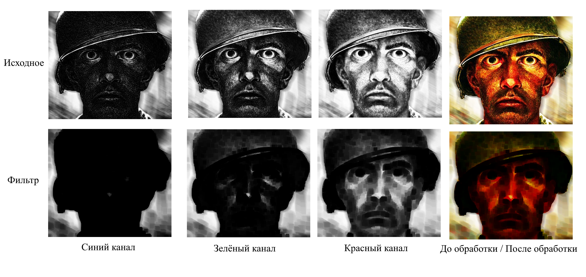

#   Проект лабораторной работы №1 по дисциплине "Системы копьютерного зрения"
##  Основная информация о задании
&ensp; В рамках данной работы было необходимо реализовать следующие фильтры:
1. Эрозия
2. Дилатация
3. Медианый фильтр
4. Фильтр Гаусса
5. Корректировка освещения
6. Бинаризация

### Дополнительная информация
&ensp; В качестве среды выполнения был выбран сервис Colab, так как имеется опыт работы в данной системе. 

&ensp; В качестве тестового изображения был взят цветной мем размерностью 351x400 (длина; высота), файл носит название MEM_OPEN_CV.jpg .

&ensp; В файлах данного репрезитория можно найти файл с сервиса Colab, содержащий в себе весь проект.

&ensp; В папке Image хранятся изображения, используемые в данном файле README.

##  Размерность итогового и начального изображения
  Так как в проекте применяются фильтры, основанные на методе свёртке изображений, то размерность итогового изображения всегда меньше начального. Однако, в рамках повышения качества работы фильтра и для того, чтобы перенести на итоговое изображение всю информацию из начального изображения - необходимо предварительно увеличить размер начального изображения так, чтобы после проведения свёртки получившиеся изображение имело размер начального.
  
&ensp; Для этого необходимо увеличивать исходное изображение на величину *(d-1)/2*ц (где d - сторона квадратного ядра свёртки) в каждом из четырёх направленией (верхняя, нижняя, левая, правая грань).
Поэтому исходное изображение преобразуется в матрицу значений, после чего создаётся матрица размером, определяемым по формуле выше, после чего старое изображение вставляется в эту матрицу.

&ensp;Теперь необходимо обговорить, как будут заполнятсья новые пустые значения. Предполагается, что используемые ядра свёртки на несколько порядок меньше, чем размер изображения, что ведёт к тому, что информация по краям будет представлять собой меньшую часть изображения, что позволяет применить сравнительно простые техники заполнения. В частности - копирование и растягивание соседнего пикселя. Данный метод является одним из простейших, но при этом даёт приемлемый результат.
  
## Общий алгоритм работы
  &ensp;В проекте каждый фильтр реализован в своём независимом блоке, что упрощает работу с проектом и позволяет независимо друг от друга надстраивать фильтры. Все этапы обработки изображения от его растягивания до конечной свёртки прописаны индивидуально в каждом блоке.

  &ensp;После загрузки изображения, происходит его разбивка на три цветовых канала (BRG), что позволяет получить три матрицы изображения в оттенках серого (однако, под серым подрузамевается цвет цветового канала).

  &ensp;Фильтр применяется к каждому каналу изображения, после чего информация с канналов суммируется и обратно превращается в системиу RGB, что позволяет востановить обычное цветное изображение

## Фильтры
### Эрозия
&ensp; Данный фильтр основан на поиске наиболее тёмного пикселя в области ядра свёртки, после чего присваивать найденное значение центральному пикселю ядра свёртки. Фактически, результатом работы является выбор наиболее тёмного пикселя в определённой области. Как правило, после данного фильтра изображения получают эффект размытия с выделением тёмных участков изображения (все тёмные участки становятся больше по размерам и более ярко выраженными).

&ensp;На изображении ниже можно видеть этапы работы фильтра.

### Диалотация
&ensp; Данный фильтр работает аналогично предыдущему (эрозии), но с той разницей, что в ядре свёртки ищется не самый тёмный пиксель, а самый светлый. Что, фактически, делает итоговое изображение более светлым и с более светлыми цветами. 
&ensp; Результат работы данного фильтра представлен на изображении ниже.

